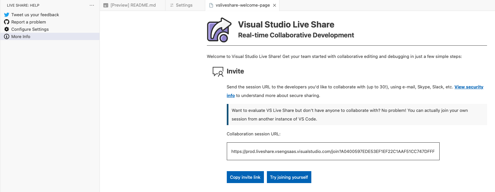
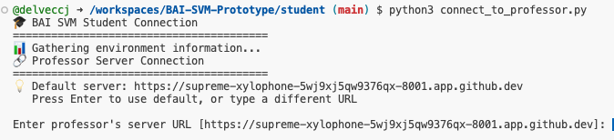
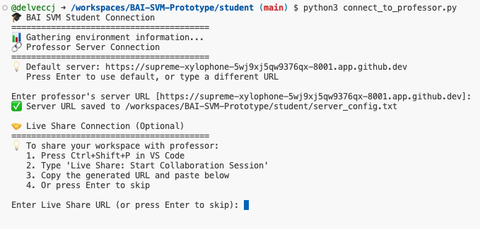

# 🎓 BAI SVM Prototype - Classroom Connection

> **A proof-of-concept for real-time professor-student Codespace connectivity**

This prototype demonstrates an innovative teaching system where professors can connect to and view student GitHub Codespaces in real-time during lectures. Built for the "Basics of AI" course SVM module.


## 📸 Visual Connection Guide for Students

Follow these visual steps to connect to your professor's dashboard:

### Step 1: Start your Codespace
**Start your Codespace from this repository** - this will open VS Code in your browser with a fully configured development environment.

### Step 2: Start Live Share Session


**Create your Live Share session first:**
- Press `Ctrl+Shift+P` in VS Code
- Type "Live Share: Start Collaboration Session"
- Copy the generated URL - you'll need this!

### Step 2: Run Connection Script


**Connect to the professor's server:**
- Open terminal in your Codespace
- Run: `python student/connect_to_professor.py`
- Press Enter to use the default server URL

### Step 3: Enter Live Share URL


**Paste your Live Share URL:**
- When prompted, paste the Live Share URL you copied in Step 1
- This allows the professor to join your workspace for real-time help

### Step 4: You should be connected!

## 📸 Visual Connection Guide for Professor

### For Professors:

1. **Start the server**:
   ```bash
   python server/professor_server.py
   ```
2. **Open dashboard**: http://localhost:8000
3. **Access student desktops** via Live Share links
4. **See connected students** in real-time!
5. **Use the full desktop environment** for demonstrations